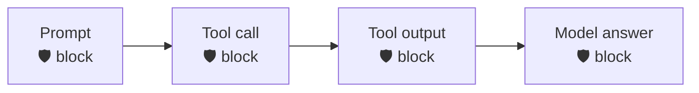

<div align="center">

# 🛡️ Cline × Prisma AIRS

**Scan every checkpoint of Cline — prompt, tool call, tool output, and final answer — through [Prisma AIRS](https://pan.dev/prisma-airs/).**


&nbsp;<a href="../README.md">↩ all agents</a>

</div>

## Quick start

**1 · Copy the `.clinerules/` folder into your Cline project** — pick the cell for your OS **and** runtime:
```bash
cp -r nodejs/.clinerules  /path/to/your/project/      # macOS/Linux (or bash/.clinerules)
# Windows: use powershell/.clinerules — it is the ONLY cell Cline can discover on win32
```

> [!IMPORTANT]
> **Copying the folder is not enough — hooks are OFF until you flip Cline's master switch:**
> Settings → **"Enable lifecycle and tool hooks during task execution"** (defaults to off).
> Until then nothing runs and nothing is logged — the install is silently inert.
>
> **Discovery is by filename, per platform.** Cline on **Windows** looks for `<Event>.ps1`
> in `.clinerules/hooks/` (anything else — extensionless, `.cmd` — is invisible), so the
> `nodejs/` and `bash/` cells are **macOS/Linux only**. On **Windows**, per-hook toggles are
> not implemented in Cline yet (its UI says so) — enablement is simply *file present + master
> switch on*. On macOS/Linux, each discovered hook also has its own per-hook toggle in the UI.

**2 · Set your Prisma AIRS credentials**
```bash
export PRISMA_AIRS_API_KEY="your-api-key"
export PRISMA_AIRS_PROFILE_NAME="your-profile"
```

> [!IMPORTANT]
> **Configure before you rely on it.** With **no `PRISMA_AIRS_API_KEY`** set, a fresh install **passes traffic through unscanned** and prints a loud `NOT CONFIGURED` warning on every call — so copying the folder in won't brick Cline, but you are **not protected** until credentials land. Once a key **is** set, any AIRS error (or a half-config with a key but no profile) fails **closed** on the input side.

> [!WARNING]
> **In production, set `AIRS_REQUIRE_CONFIG=1`.** Cline is an env-writer (it has file/shell tools), so an injected instruction could delete this install's `.env` — a benign-looking file op AIRS won't flag — to *force* the unconfigured state and silently bypass scanning. `AIRS_REQUIRE_CONFIG=1` makes that fail **closed** (a loud DoS, not a bypass). Also deny the agent write access to the hooks dir. See [SECURITY.md](../SECURITY.md).

**3 · Start Cline — done.** Every checkpoint below is now scanned.

## Choose your runtime

| Runtime | Requires | Best for |
|:--|:--|:--|
| [`nodejs/`](nodejs/) | Node 18+ · zero deps | Full engine — DLP mask-in-place + chunking |
| [`bash/`](bash/) | `jq` + `curl` | macOS / Linux |
| [`powershell/`](powershell/) | PowerShell 5.1+ / 7 · no `jq`/`curl` | Windows-native |

Each folder is self-contained (engine + wiring + `.clinerules/`). Shared `example.env` documents every variable; `tests/` runs the same fixtures against all three runtimes.

## Coverage

| Prompt | Response | Streaming | Pre-tool | Post-tool |
|:--:|:--:|:--:|:--:|:--:|
| ✅ | ✅ | ❌ | ✅ | ✅ |

<div align="center"><sub>✅ hard-block &nbsp;·&nbsp; ⚠️ scan + alert / redact &nbsp;·&nbsp; ❌ no usable surface in the hook contract</sub></div>




<details>
<summary><b>How enforcement works in Cline</b></summary>

<br>

Prompt scanned on input; the model's answer on Stop; tool input/output as `tool_event` (method `tools/call`) so tool results are checked for **indirect prompt injection**, not treated as a plain response.
</details>

<div align="center">
<br>
<sub>MIT © 2026 Palo Alto Networks &nbsp;·&nbsp; <a href="../README.md">all agents</a> &nbsp;·&nbsp; <a href="https://pan.dev/prisma-airs/api/airuntimesecurity/usecases/">detection categories</a></sub>
</div>
