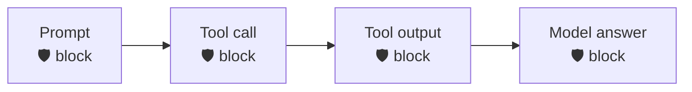

<div align="center">

# 🛡️ Codex × Prisma AIRS

**Scan every checkpoint of Codex — prompt, tool call, tool output, and final answer — through [Prisma AIRS](https://pan.dev/prisma-airs/).**


&nbsp;<a href="../README.md">↩ all agents</a>

</div>

## Quick start

**1 · Copy the `.codex/` folder into your Codex project** — pick the runtime you have:
```bash
cp -r nodejs/.codex  /path/to/your/project/      # or  bash/.codex  ·  powershell/.codex
```

**2 · Set your Prisma AIRS credentials**
```bash
export PRISMA_AIRS_API_KEY="your-api-key"
export PRISMA_AIRS_PROFILE_NAME="your-profile"
```

> [!IMPORTANT]
> **Configure before you rely on it.** With **no `PRISMA_AIRS_API_KEY`** set, a fresh install **passes traffic through unscanned** and prints a loud `NOT CONFIGURED` warning on every call — so copying the folder in won't brick Codex, but you are **not protected** until credentials land. Once a key **is** set, any AIRS error (or a half-config with a key but no profile) fails **closed** on the input side.

> [!WARNING]
> **In production, set `AIRS_REQUIRE_CONFIG=1`.** Codex is an env-writer (it has file/shell tools), so an injected instruction could delete this install's `.env` — a benign-looking file op AIRS won't flag — to *force* the unconfigured state and silently bypass scanning. `AIRS_REQUIRE_CONFIG=1` makes that fail **closed** (a loud DoS, not a bypass). Also deny the agent write access to the hooks dir. See [SECURITY.md](../SECURITY.md).

**3 · Start Codex — done.** Every checkpoint below is now scanned.

## Choose your runtime

| Runtime | Requires | Best for |
|:--|:--|:--|
| [`nodejs/`](nodejs/) | Node 18+ · zero deps | Full engine — DLP mask-in-place + chunking |
| [`bash/`](bash/) | `jq` + `curl` | macOS / Linux |
| [`powershell/`](powershell/) | PowerShell 5.1+ / 7 · no `jq`/`curl` | Windows-native |

Each folder is self-contained (engine + wiring + `.codex/`). Shared `example.env` documents every variable; `tests/` runs the same fixtures against all three runtimes.

## Coverage

| Prompt | Response | Streaming | Pre-tool | Post-tool |
|:--:|:--:|:--:|:--:|:--:|
| ✅ | ✅ | ❌ | ✅ | ✅ |

<div align="center"><sub>✅ hard-block &nbsp;·&nbsp; ⚠️ scan + alert / redact &nbsp;·&nbsp; ❌ no usable surface in the hook contract</sub></div>

> [!IMPORTANT]
> **Validated against Codex CLI 0.150.0 (live + source).** A live 0.150.0 session measured the previous exit-2 prompt block being reported as `hook (failed) — hook exited with code 1` and answered anyway: Codex reads its **shell wrapper's** exit status verbatim (a PowerShell-style wrapper collapses any child failure to 1), and every exit code other than 0/2 is a hook *failure* = **fail-open**. The engines now block via the stdout-JSON forms Codex's own integration suite pins (`codex-rs` tag `rust-v0.150.0`): `{"decision":"block","reason":…}` on `UserPromptSubmit`/`PostToolUse`, `permissionDecision:"deny"` on `PreToolUse`, `{"continue":false}` on `Stop` — always exit 0, stdout carrying nothing but the JSON. Three Codex-side gates still apply and are called out below: hooks must be **trusted** (interactive prompt; re-fires when `hooks.json` changes), **synchronous** (`async:true` can never block), and the `hooks.json` must parse (Codex rejects unknown keys — including `"//"` comment keys — and discards the whole file with a one-line warning). Warnings ride `{"systemMessage":…}` — stderr is ignored on exit 0. Re-run `tests/run-tests.sh live` after any Codex CLI upgrade; the wire contract is version-measured, not guaranteed.


<details>
<summary><b>How enforcement works in Codex</b></summary>

<br>

Codex CLI reads hooks from the project's `.codex/hooks.json`: the engine scans the prompt on input, the model's answer on `Stop`, and tool input/output as a `tool_event` (`tools/call`) for **indirect prompt injection**. Blocks are rendered as **stdout JSON on exit 0** (never exit 2 — Codex reports its shell wrapper's exit status, and any code other than 0/2 fails open as a hook *failure*). The forms match Codex's own integration fixtures at `rust-v0.150.0`: a blocked prompt produces **zero model requests** and a red `UserPromptSubmit hook (blocked)` cell. Requires `codex_hooks = true`, a **trust** decision (interactive; re-fires on every `hooks.json` edit), and synchronous handlers. Known Codex-side limits, measured: the **VS Code extension does not run hooks at all** (CLI-only today), and `codex exec` skips hooks silently unless trust was persisted or `--dangerously-bypass-hook-trust` is passed.
</details>

<div align="center">
<br>
<sub>MIT © 2026 Palo Alto Networks &nbsp;·&nbsp; <a href="../README.md">all agents</a> &nbsp;·&nbsp; <a href="https://pan.dev/prisma-airs/api/airuntimesecurity/usecases/">detection categories</a></sub>
</div>
