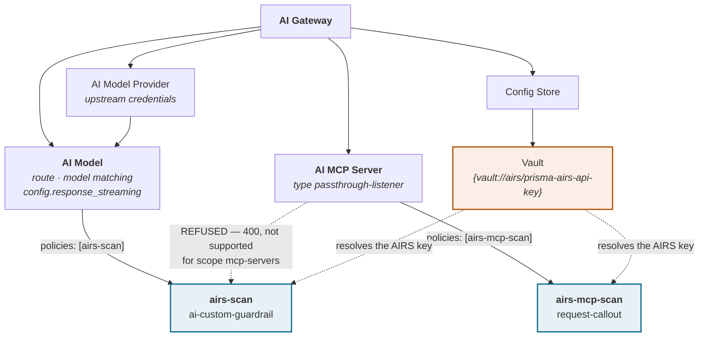
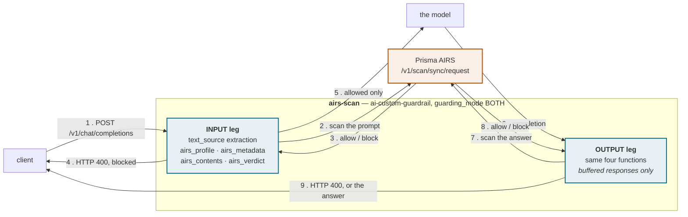
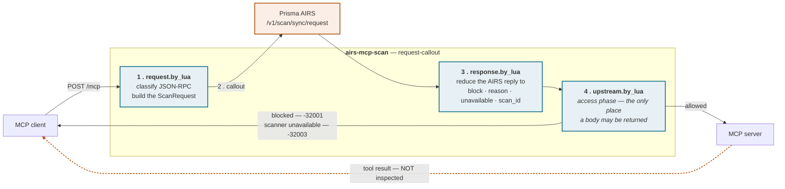

# Design

Prisma AIRS enforcement on Kong AI Gateway 2.x, expressed entirely as configuration: no custom plugin, no
rebuilt image, and Lua that travels inside the policy rather than as a package on disk. `docs/DEPLOYMENT.md`
is the runbook, `docs/CREDITS.md` the full attribution.

| Tag | Meaning |
| --- | --- |
| DOCUMENTED | Stated by Kong or by Palo Alto Networks in published documentation, or visible verbatim in this repository's source. |
| MEASURED | Established on a live gateway. Unless stated otherwise the date is 2026-09-12 and the runtime is Kong AI Gateway 2.0.3, Konnect control plane, self-managed data plane in Docker, scanner Prisma AIRS API Intercept `/v1/scan/sync/request`. |
| UNVERIFIED | Believed, not tested. Never relied on by the design. |

No tenant-specific value appears here; placeholders are `<AI_GATEWAY_ID>`, `<REGION>`, `my-profile`,
`my-model`, `my-mcp`.

| Traffic | Policy type | Scope | Enforcement point |
| --- | --- | --- | --- |
| LLM (OpenAI-format chat completions) | `ai-custom-guardrail` | AI Models | the guardrail's own block contract |
| MCP (JSON-RPC over HTTP) | `request-callout` | AI MCP Servers | `config.upstream.by_lua`, access phase |

It is two policies because it has to be (4.1). DOCUMENTED: Kong's hub ships guardrail integrations for AWS,
Azure, GCP, Lakera and NVIDIA NeMo. There is no Palo Alto Networks entry, and `ai-custom-guardrail` is the
documented generic hook — "Integrate with any 3rd-party Guardrail service."

---

## 1. The entity model as it matters here

AI Gateway 2.x is a separate entity tree, not a Kong Gateway control plane with AI features bolted on.
MEASURED: AI Gateways are not under `/v2/control-planes` but at
`https://<REGION>.api.konghq.com/v1/ai-gateways`, with sub-resources `policies`, `models`,
`model-providers`, `mcp-servers`, `agents`, `consumers`, `nodes`, `certificates`, `data-plane-certificates`,
`auth-strategies` and `config-stores`; `dp-client-certificates`, `data-planes` 404.

| Entity | Declarative key | What it is here |
| --- | --- | --- |
| AI Gateway | `!lookup { id: !env AI_GATEWAY_ID }` | The container for everything below. Created by a three-step wizard: control plane, data plane type, deploy instances. MEASURED: no region field — region comes from the organisation. |
| AI Model Provider | `ai_gateway_model_providers` | Upstream credentials and provider flavour. Discriminated union; `type:` selects `openai`, `azure`, `bedrock` and others. |
| AI Model | `ai_gateway_models` | The client-facing route, the model-matching rule, the targets, and `config.response_streaming`. Union selector `type: model` or `type: api`. |
| AI MCP Server | `ai_gateway_mcp_servers` | An MCP endpoint. Union selector with five values: `conversion-only`, `conversion-listener`, `listener`, `passthrough-listener`, `upstream-server`. This design targets `passthrough-listener`. |
| AI Policy | `ai_gateway_policies` | The unit of enforcement. Both halves of this integration are policies. |
| Vault | `ai_gateway_vaults` | Resolves `{vault://<vault-name>/<key>}`, and decides *where* the AIRS key rests (section 9). |

MEASURED: `kongctl explain <res> --extended` omits union selector fields, so `type:` is invisible and the
apply fails with `missing required union selector type`; `kongctl scaffold <res>` is authoritative.

### What binds to what

**MEASURED: an AI Policy defaults to `global: false`, and in that state it intercepts nothing.** A
policy that is written, applied and then never listed anywhere silently does nothing, with no warning. It
becomes active either by being named in the consuming entity's `policies:` list — the value is the policy's
`name`, not its declarative `ref` — or by `global: true`, which covers every model, MCP server and agent on
the gateway.

```yaml
ai_gateway_models:
  - ref: my-model
    policies: [airs-scan]

ai_gateway_mcp_servers:
  - ref: my-mcp
    policies: [airs-mcp-scan]
```

Binding by name keeps the blast radius to the entities an operator chose, and makes coverage only as good as
the binding: a caller reaching a model whose policy was never attached is not scanned. MEASURED:
`response_streaming: allow|deny` is a field on the AI **Model** (`config.response_streaming`), not on any
policy; it is the remedy for GAP 1 (8.1), applied to the model. Routing and upstream-URL traps are in the
troubleshooting table of `docs/DEPLOYMENT.md`.

---



A policy attaches by **name**, and a policy that is never named anywhere defaults to `global: false`
and silently intercepts nothing.

---

## 2. What an AI Policy is at runtime

DOCUMENTED, from Kong's changelog and quoted in `config/llm/airs-guardrail.yaml`: "policies are a control
plane concept. In the runtime they're implemented as plugins." MEASURED 2026-09-12 on the data plane
container for AI Gateway 2.0.3:

- The data plane's telemetry URL reports `node_version=3.14.0.3` alongside `kong_aigw_version=2.0.3`,
  `kong version` answers "Kong AI Gateway 2.0.3", and the image's OCI label is
  `org.opencontainers.image.title=kong-ee`.
- `/usr/local/share/lua/5.1/kong/plugins/` holds the full classic plugin set, over a hundred directories
  — `ai-custom-guardrail`, `request-callout`, `post-function`, `pre-function`, `ai-proxy`,
  `ai-proxy-advanced`, `ai-mcp-proxy`, `ai-prompt-guard` and the rest.

The conclusion to draw, stated carefully and not further:

> The runtime is Kong Gateway 3.14 with the classic plugin loader intact. What AI Gateway 2.x removes
> is the **control plane surface for declaring a custom plugin** — not the runtime's ability to run Lua.

That is why this is possible at all, and why it is shaped this way: with no supported path to *declare* a
custom plugin, the Lua arrives as the value of a config field on a policy that already exists.

The Lua therefore lives in real `.lua` files, inlined into the policy at build time by
`scripts/build-config.py` and unit-tested offline by `spec/verdict_spec.lua` and
`spec/mcp_callout_spec.lua` (40 and 66 assertions, 106 in total) — Lua living only inside a YAML string is Lua nobody
lints or reviews.

---

## 3. The LLM path, end to end



A streamed response never reaches the OUTPUT leg, and tool-call arguments are not part of the text
Kong extracts. Both are in section 8.


One `ai-custom-guardrail` policy, `guarding_mode: BOTH`. On the INPUT leg Kong matches the route on
`body.model`, extracts the prompt text, builds the AIRS `ScanRequest` from `$(airs_profile)`,
`$(airs_metadata)` and `$(airs_contents)`, POSTs it and applies `$(airs_verdict.block)`: a block is HTTP 400
and the model is never called, otherwise the model answers and the completion goes through the same four
functions on the OUTPUT leg before the client sees it.

DOCUMENTED enum: `BOTH | INPUT | OUTPUT`. MEASURED: `BOTH` genuinely runs both legs — confirmed in Strata
Cloud Manager (SCM) as two separate transactions, one Prompt, one Response. The direction is not cosmetic:
AIRS keys the two differently (`contents[].prompt` versus `contents[].response`) and runs a different
detector set on each. The built-in `$(source)` is `INPUT` or `OUTPUT`, and it is what the content function
switches on.

### 3.1 How a function is called

MEASURED 2026-09-08 (`docs/CREDITS.md`): functions are referenced **bare** and Kong injects
built-ins **by parameter name** — `airs_contents` receives `source` and `content` because its parameters are
named that. The explicit-argument form `$(airs_contents(source, content))` returns HTTP 500 `failed to
render by function: invalid expression syntax`. The injectable parameter allowlist is exactly `source`,
`content`, `conf`, `resp`; `consumer`, `model`, `route`, `service`, `request`, `headers` and `kong` are
rejected outright with `argument '<name>' is not allowed in guardrail functions`. That constraint drives
section 7.

### 3.2 The four functions

| Function | Runs | Returns | Refuses when |
| --- | --- | --- | --- |
| `airs_profile(conf)` | every scan, both legs | `{ profile_name = conf.params.profile }` | — |
| `airs_metadata(conf)` | every scan, both legs | `{ app_name = … }`, plus `app_user` / `ai_model` only if an operator set them | — |
| `airs_contents(source, content)` | every scan, both legs | `{{ prompt = content }}` on INPUT, `{{ response = content }}` on OUTPUT | `content` is not a string; `content` is empty; `source` is neither `INPUT` nor `OUTPUT` |
| `airs_verdict(resp)` | after the AIRS reply, both legs | `{ block, block_message, detail }` | section 5.1 |

`airs_contents` raising is deliberate: a fallback such as `content or ""` would JSON-encode whatever arrived
— potentially the whole `conf` table — into `contents[].prompt` and ship it to AIRS and the SCM scan log,
and AIRS returns `allow` on an empty string, so a silent extraction gap would become a recorded clean scan
of nothing. MEASURED 2026-09-08: a raising guardrail function fails the request closed at HTTP
500 (UNVERIFIED whether the raised text reaches the client, so no message carries a config value or
credential). `airs_metadata` sends `app_user` and `ai_model` only when configured — a fabricated user in a
security log is worse than none.

What they are given is set by `text_source: concatenate_all_content`, over the schema default
`last_message`, because it is the only value under which a `role: "tool"` result — untrusted external text
injected into the conversation — reaches the scanner. MEASURED 2026-09-08: the extracted text is
the message contents joined by `"\n\n"` in **reverse chronological order**, system prompt included. So a
system prompt that reads like an injection is a standing false-positive surface, larger payloads cost more
AIRS tokens per scan, and an analyst reading an SCM record should expect the conversation backwards.

### 3.3 How a block reaches the client

MEASURED 2026-09-12, with `rejection_mode: none`:

```text
benign prompt      -> HTTP 200, answer returned
prompt injection   -> HTTP 400
                      {"error":{"message":"Blocked by Prisma AIRS [scan_id=<uuid>]"}}
```

It is **400, not 403**. The Kong Gateway 3.x custom plugin returns 403 for the same event, so clients and
log-based alerting keyed on the status must expect the difference; the MCP half answers 403 (4.4), so the
two halves do not share a status code either. UNVERIFIED: the exact status line and body of `rejection_mode:
stealth`; if it is used, expect the `scan_id` to stop reaching the client and the support path in 7.4 to go
with it. The two gaps on this path — streamed responses and tool calls — and the metrics defect are in
section 8. Do not deploy this half without reading it.

---

## 4. The MCP path, end to end



Every hook sits to the left of the upstream call. Nothing in this policy runs after the MCP server
answers, which is why the dashed return path is unscanned.


### 4.1 Why `request-callout` and not a guardrail

`ai-custom-guardrail` cannot be attached to an MCP server: MEASURED 2026-09-12, the Konnect control plane
refuses the update.

```text
400 Bad Request
policies: policy "<name>" of type "ai-custom-guardrail" is not supported
for scope "mcp-servers"
```

That is the API confirming, rather than the reader inferring, the gap Kong states in the `ai-mcp-proxy`
scope-of-support table: "AI Guardrails | Applying guardrails to MCP AI plugin requests and responses | Not
supported" (DOCUMENTED). MEASURED: `request-callout` **is** accepted at `mcp-servers` scope, the only
configuration-level way found to send MCP content to a scanner and act on the answer.

### 4.2 The three hooks, and the fact that decides the design

DOCUMENTED — the schema declares exactly three Lua hooks: `callouts[].request.by_lua` ("executes before the
callout request is made"), `callouts[].response.by_lua` ("executes after the callout response is received" —
AIRS's reply, not the MCP server's), and `config.upstream.by_lua` ("executes before the upstream request is
made").

**DOCUMENTED: all three run before the upstream request.** The schema declares no `header_filter`, no
`body_filter`, no response-phase hook of any kind. **MEASURED: the consequence is real** — a payload placed
in a tool *result* is delivered to the client with HTTP 200, so the MCP response leg is unreachable by this
policy; 4.5 and 8.3 have the measurement and the consequences.

`config.upstream.by_lua` runs in the **access phase**. DOCUMENTED: the Kong PDK permits `kong.response.exit`
with a body only in `preread`, `rewrite`, `access` and `admin_api` — the entire reason an in-protocol error
is possible, and why enforcement lives in `upstream.by_lua` alone. In order: `request.by_lua` classifies the
envelope and builds the `ScanRequest`; the callout fires; `response.by_lua` reduces the reply to `{ block,
reason, scan_id }` in `kong.ctx.shared`; `upstream.by_lua` reads it and either falls through to the MCP
server or exits 403. The server's answer then returns to the client uninspected.

### 4.3 `request.by_lua` — classify and build

It reads the client's JSON-RPC envelope, writes the `ScanRequest` into the callout body and records the
classification, method, id and scanned flag in `kong.ctx.shared`. The rules, in
`lua/callout/request_by_lua.lua` and exercised by `spec/mcp_callout_spec.lua`:

| Input | Classification | Sent to AIRS as |
| --- | --- | --- |
| `tools/call` with encodable `params.arguments` | `tool_event` | a `contents[].tool_event` with `ecosystem: mcp`, `method: tools/call`, `server_name`, `tool_invoked`, and `input` as a JSON **string** |
| `tools/list` | `bypass` | nothing — the catalogue is in the reply, which this policy cannot see |
| `ping`, `initialize`, `notifications/*`, `logging/setLevel`, or any content-bearing method with no `params` table | `bypass` | nothing |
| any other content-bearing method (`resources/read`, `prompts/get`, `completion/complete`, `sampling/createMessage`, `elicitation/create`, vendor extensions) | `prompt` | a `contents[].prompt` holding the encoded `params` |
| a body that does not decode to a JSON object | `unparseable` | nothing, and it is **not** treated as scanned |
| a top-level JSON array (JSON-RPC batch) | `batch` | nothing, and it is **not** treated as scanned |
| anything without `jsonrpc: "2.0"` and a string `method` | `not-jsonrpc` | nothing, and it is not treated as scanned |
| classification or encoding threw | `error`, `fatal` | nothing, and the message is refused |

Three rows are load-bearing.

- **The method allowlist is forced by AIRS, not chosen.** MEASURED against the AIRS scan API (4.6):
  `tool_event.metadata.method` is validated against exactly `tools/call` and `tools/list`; every other
  method is refused with `400 unsupported method`, `initialize` included, so a gateway submitting
  `initialize` as a tool event would fail the first message of every MCP session closed. Out-of-allowlist
  methods carrying caller text go as a **prompt**, which has no method allowlist: same coverage, different
  shape.
- **The bypass set carries no caller text on the request leg**, and AIRS allows an empty string, so
  scanning it would record a clean scan of nothing. `request-callout` has no conditional-skip field, so
  the callout fires anyway with a placeholder prompt of `"."`, the message is recorded as a bypass, and
  `upstream.by_lua` ignores its verdict — at the cost of one AIRS call per control message and an SCM
  record that is a clean scan of a single dot (7.5).
- **A batch refuses classification rather than inspecting element one**, since inspecting the first and
  waving the rest through is an evasion primitive. But refusing to classify is not refusing the message:
  a batch, like any body that is not a well-formed JSON-RPC envelope and like a body that does not decode
  at all, is marked not scanned and reaches the upstream uninspected. To refuse them outright, treat
  `batch`, `not-jsonrpc` and `unparseable` the way `upstream.by_lua` treats `fatal`. UNVERIFIED: Kong's
  behaviour on receiving a batch at an MCP route.

The hook also unescapes cjson's forward-slash escaping, since handing a path detector `\/etc\/shadow` lowers
the detection rate on exactly the arguments that matter, and attaches correlation from Kong rather than the
caller (7.3). `response.by_lua` then parses once, safely — DOCUMENTED by Kong, a nil reference inside
`by_lua` is an Internal Server Error at runtime — so all parsing risk sits in one hook inside a `pcall`,
which applies the same degradation tests as the LLM verdict function (5.1) and leaves the enforcement hook
reading only booleans and strings.

### 4.4 The denial contract

MEASURED 2026-09-12, through the gateway with the callout attached, HTTP 403:

```json
{"jsonrpc":"2.0",
 "error":{"message":"Blocked by Prisma AIRS [scan_id=<uuid>]","code":-32001},
 "id":<caller's id>}
```

An MCP client that receives a bare HTTP 403 sees a transport failure, and several SDKs tear the session down
on one. A JSON-RPC error carrying the caller's **own** request id is a tool failure instead: the client
surfaces it against the call that caused it and the session survives. When the id cannot be recovered
`cjson.null` is sent, never a fabrication.

| Code | Meaning | Raised when |
| --- | --- | --- |
| `-32001` | policy block | AIRS returned a block, or classification itself failed fatally so the content was never inspected |
| `-32003` | scanner unavailable | no verdict record at all, a partial scan failure, a degraded detector, an unparseable verdict, or the enforcement hook itself throwing |

Both codes match PANW's Kong Gateway 3.x plugin exactly, so a client that has learned one Prisma AIRS
integration has learned both. DOCUMENTED: from Kong Gateway 3.14 onward Kong's own MCP **authorization**
denials follow the MCP 2025-11-25 specification and answer 403 — that specification does not govern scan
verdicts, and this integration matches it only so one denial shape comes off the MCP route.

### 4.5 Measured behaviour

MEASURED 2026-09-12, through the gateway with the callout attached:

| Request | Result |
| --- | --- |
| `tools/call`, clean arguments | 200, allowed |
| `tools/call`, injection in arguments | **403**, JSON-RPC error, code `-32001` |
| `tools/call`, payload in the **result** | **200, DELIVERED** — the response leg is unreachable |
| `initialize` | 200, bypassed unscanned |
| `tools/list` | 200, bypassed on the request leg |

MEASURED: the route requires `Accept: application/json, text/event-stream`; without it the MCP proxy answers
`406 Not Acceptable`, so a 406 in testing is almost always that header, not a policy fault.

### 4.6 The AIRS `tool_event` contract, as measured

MEASURED 2026-09-12 against the AIRS scan API, independently of Kong; the shape is easy to get wrong in a
way that looks like it worked. **`tool_event` is a member of a `contents[]` element, not a top-level sibling
of `contents`.** At the top level the API answers HTTP 400 with
`{"error":{"message":"\"empty content data\"\n"}}` and silently ignores the tool event — a message that
never mentions tool events. The decisive one comes from a request carrying an empty content object:

```text
content validation failed: at least one of Prompt, Response, CodePrompt,
CodeResponse, or ToolEvent must be provided
```

The correct shape:

```json
{"ai_profile": {"profile_name": "my-profile"}, "metadata": {"app_name": "kong-ai-gateway"},
 "contents": [{"tool_event": {"metadata": {"ecosystem": "mcp", "method": "tools/call",
    "server_name": "my-mcp", "tool_invoked": "get_customer"}, "input": "{\"id\":\"42\"}"}}]}
```

`input` and `output` are **strings containing JSON**, not nested objects; a native object earns `400
received wrong request format`. `tool_invoked` **is** accepted by the API, and is echoed back in the
detection record, naming the tool. `server_name` is pinned at build time from `AIRS_MCP_SERVER_NAME`,
since a callout `by_lua` cannot read its own config.

MEASURED detections against that API:

| Submitted | `action` | `category` | Detail |
| --- | --- | --- | --- |
| clean tool input | allow | benign | — |
| injection in tool ARGUMENTS, as `input` | block | malicious | threats `["context poisoning"]`; detectors agent + injection + toxic_content |
| injection in tool RESULT, as `output` | block | malicious | same detectors |
| a poisoned `tools/list` catalogue, as `output` | block | malicious | `tool_invoked` names the poisoned tool |

**State the conclusion in this order: AIRS can detect tool poisoning and malicious tool results today.
The limitation is Kong's** — `request-callout` has no hook that sees the response leg, so the gateway has
nothing to hand AIRS for rows three and four; the scanner is not the missing piece (8.3).

### 4.7 Attachment caveats

The policy is written for `passthrough-listener` MCP servers, where there is a real upstream and the tool
descriptions are attacker-controlled rather than Kong's own configuration. UNVERIFIED: `conversion-listener`
mode, where `ai-mcp-proxy` rewrites the call into REST and it is unknown whether the callout still sees
JSON-RPC. UNVERIFIED: plugin ordering — `ai-mcp-proxy` runs at 820 and `request-callout` at 812, and
`kong.response.exit` interrupts the phase, so anything Kong answers itself (a `tools/list` from its own
definitions, an ACL denial) plausibly never reaches the callout. Assume those paths exist until measured.

---

## 5. Fail-closed behaviour

The rule is the same on both paths: **anything that is not a positive, unambiguous `allow` is a block.** A
message that was never scanned is not a message that passed.

### 5.1 LLM path — every condition under which `airs_verdict` blocks

Read in order; the first match wins.

| # | Condition | `detail` recorded |
| --- | --- | --- |
| 1 | `resp` is not a table, or `resp.action` is not a string | `verdict unavailable (fail-closed)` |
| 2 | `resp.error` is set (anything but `nil`/`false`) | `partial scan failure (fail-closed)` |
| 3 | `resp.timeout` is set | `partial scan failure (fail-closed)` |
| 4 | `resp.errors` is a non-empty table | `detector degraded (fail-closed): <feature>/<status>, …` |
| 5 | `resp.category` is `error` or `timeout` | `scan <category> (fail-closed)` |
| 6 | `resp.action` is anything other than exactly lowercase `allow` | the category when the action is `block`, otherwise `unrecognised action (fail-closed)`, plus the names of the detectors that fired |

Conditions 2 to 4 matter most and are the ones most integrations omit. The AIRS `ScanResponse` carries
`error` and `timeout` on every 200 body, plus an `errors[]` array naming the degraded detector
(`{content_type, feature, status}`). A detector can fail or time out while the verdict still returns
`action: "allow"` — the scan did not say the content is safe, it said it could not finish looking, and a
verdict keyed only on `action` or `category` reads that as a clean pass. The test for "set" is loose, so a
string cannot read as "no problem"; condition 6 maps no near-misses, because the safe reading of an unknown
word is "not a pass".

`airs_contents` raises when the content is not a string, is empty, or the phase is unrecognised, and a
raising function fails the request closed at HTTP 500 (MEASURED 2026-09-08). `airs_verdict` keeps
an inactive branch decoding `resp` as a string, because a release that ever did pass one would fail every
request closed: MEASURED 2026-09-08, `$(resp)` is a Lua table in **both** phases on 2.0.3,
contradicting Kong's plugin overview.

### 5.2 The one deliberate exception

`category` alone is **not** a block on the allow path. An AIRS profile in alert-only mode returns
`action: "allow"` alongside `category: "malicious"`, and that is the profile owner exercising a legitimate
choice: the gateway enforces the verdict AIRS returns, it does not second-guess the profile. This is the
only signal-looking thing intentionally let through, and it is the difference between enforcing a policy
and overriding it.

### 5.3 MCP path — every condition under which `upstream.by_lua` refuses

| # | Condition | Code | Message to the client |
| --- | --- | --- | --- |
| 1 | classification itself failed (`mcp.fatal`) — the content was never inspected | `-32001` | `Blocked by Prisma AIRS` |
| 2 | no verdict record at all: `response.by_lua` never ran, so the callout never completed | `-32003` | `Prisma AIRS scan unavailable` |
| 3 | verdict blocks and carries `unavailable = true` — `response.by_lua` sets that field on every degradation branch: `verdict unavailable`, `verdict parse failure`, `partial scan failure`, `detector degraded`, `scan error`, `scan timeout` | `-32003` | `Prisma AIRS scan unavailable` |
| 4 | verdict blocks for any other reason (a real detection, or an unrecognised action) | `-32001` | `Blocked by Prisma AIRS [scan_id=…]` |
| 5 | the enforcement hook itself raised | `-32003` | `Prisma AIRS scan unavailable`, id `null` |

`unavailable` is a field on the verdict, set by `response.by_lua` next to the reason, and it is what this
hook reads; the literal reason strings are matched only as a fallback for a verdict written by an older
build. That matters because the old string list missed `scan error` and `scan timeout`, so an AIRS-reported
scan failure was answered as a policy block.

A message classified as a deliberate bypass (`scanned ~= true`) is allowed through, and the callout's
verdict for it is ignored rather than being allowed to block a message nobody scanned. Availability is
handled twice over. The callout's `error` block (`on_error: fail`, no retries,
`http_statuses: [429, 500, 502, 503, 504]`, `error_response_code: 502`,
`error_response_msg: "Prisma AIRS scan unavailable"`) matches the callout's **HTTP status**, and answers a
bare HTTP 502, not a JSON-RPC error. UNVERIFIED: that branch has not been observed here — a genuine network
failure of the callout was never induced. It cannot express a verdict, since AIRS returns HTTP 200 carrying
`action: "block"` in the body; what it misses — an AIRS 400 from a bad profile — falls through to conditions
2 and 3 above.

MEASURED 2026-09-12: with the AIRS profile misconfigured so the callout returned HTTP 400, **every**
`tools/call` was refused with `-32003` "Prisma AIRS scan unavailable" and the upstream was never reached.
The designed failure mode works: no scan, no tool call. On the LLM path the equivalent is
`stop_on_error: true`, DOCUMENTED but UNVERIFIED here, because the LLM leg has not been observed refusing
traffic with the scanner unreachable.
Two smaller choices reinforce it: caching is off at both levels (`cache.strategy: "off"`,
`cache.bypass: true`), because a cached security verdict is a replay surface, and headers are not forwarded
(`headers.forward: false`), since they carry the MCP session and upstream authorization that AIRS neither
needs nor should hold.

---

## 6. What the caller is told, and where the detail goes

The client sees `Blocked by Prisma AIRS`, optionally with the `scan_id`, and nothing else: never the
category, never a detector name, and **the same text on a fail-closed block as on a real detection.** A
caller who could tell "the injection detector fired" from "a detector timed out" would iterate against the
difference, turning the block into a detector-mapping oracle. The detail goes to three places:

| Channel | Carries | Status |
| --- | --- | --- |
| `detail` → `metrics.block_detail` | category plus the names of the detectors that fired | **Broken** — MEASURED, the metric is dropped with a type error (8.4) |
| The gateway error log | on the MCP path `[prisma-airs-mcp] blocked: <category> [<detector>,<detector>]`; on both paths `kong.log.err` for hook failures. A log line, not a metric: not aggregated, not exported | Works |
| Strata Cloud Manager scan log | the complete record — verdict, category, threats, detectors, and on tool events the `tool_invoked` name | Works, and is the authoritative record today |

`log_blocked_content: false` keeps the blocked prompt out of Kong's telemetry: it is content somebody tried
to push through a security control, and its access-controlled place is the AIRS scan log.

---

## 7. Correlation and its limits

On both paths the scan record identifies the gateway through `app_name` and nothing finer; on the MCP path
the callout also sends Kong's request id, the MCP session id and the tool name, and `scan_id` is the only
join key the client is ever given.

### 7.1 Why identity is unreachable on the LLM path

Only `source`, `content`, `conf` and `resp` can be injected into a guardrail function (3.1), so there is no
request context inside one: no consumer identity, no model name, no route, no request id, no headers, and
`lua/guardrail/airs_metadata.lua` builds its metadata from static policy config. **MEASURED 2026-09-12:
every scan from the shipped policy shows `model_name: None` and `user_id: None` in SCM.** Not a
configuration bug but the direct consequence of the allowlist established
(`docs/CREDITS.md`). Every request scanned by one policy lands under the same `app_name`: an operator can
tell which gateway a detection came from, not which caller sent it or which model it was headed for.
MEASURED: under `BOTH` one request produces two SCM transactions — one Prompt, one Response, same
`app_name`, each with its own `scan_id`, and nothing links them to each other.

### 7.2 Coarse attribution, in configuration

Nothing recovers per-request identity in configuration alone; what configuration can do is split traffic
across several policies, each with its own `app_name`. DOCUMENTED: the policy scopes are AI Models, AI
Consumers, AI Consumer Groups and Global. One policy per AI Consumer Group, identical except for
`params.app_name: "my-gateway/team-a"`, makes detections carry the group name; one per model also lets
`params.ai_model: "my-model"` carry a correct value. Policy count then grows linearly, each a separate
object to keep in step, and the granularity is never per-user.

### 7.3 What the MCP path can do that the LLM path cannot

`request-callout`'s `by_lua` hooks are real Lua with PDK access, which is why the MCP path is the better
instrumented one: `lua/callout/request_by_lua.lua` sends `transaction_id` from `kong.request.get_id()`,
`session_id` from the `Mcp-Session-Id` header when present, and `tool_invoked` on `tools/call`.

**The correlation id must be Kong's own.** `kong.request.get_id()` is generated by the gateway and
cannot be influenced by the caller. A client-supplied correlation header must never be used instead, because
a caller who sets the id can **pin** it (one fixed id, so a whole campaign collapses into one apparent
transaction), **split** it (a fresh id per message, so a sustained probing session looks like unrelated
calls), or **collide** it (reuse another tenant's id, so detections interleave and an investigation is
pointed at the wrong party). Anything the attacker controls is not evidence; `spec/mcp_callout_spec.lua`
asserts that `transaction_id` is Kong's id and a client-supplied header is ignored. `Mcp-Session-Id` is
omitted when absent, never replaced by a synthetic one.

UNVERIFIED: whether SCM stores and displays `transaction_id` and `session_id`, and under which column — the
fields are sent, their rendering is unmeasured, so do not build a workflow on reading them back until you
have confirmed it in your own tenant.

### 7.4 `scan_id` is the join key

MEASURED 2026-09-12: the `scan_id` in the client's block message matches the `scan_id` in the SCM record
exactly. That is the path from a user complaint to the detection record, and the only one the client is
given — in the HTTP 400 body on the LLM path (3.3), in the JSON-RPC error on the MCP path (4.4). It is a
small, deliberate leak: the caller learns a scan happened and gets an identifier that exists in a security
log. Accepted, because without it every support conversation starts with "I got an error some time this
afternoon". What is not leaked is why.

The id is appended only when the AIRS response carried one. On the fail-closed paths where no parseable
verdict came back — AIRS unreachable, an unparseable body, a missing `action` — the client sees the bare
`Blocked by Prisma AIRS` and there is no join key, because there is no scan record; those blocks are visible
in the Kong error log only.

### 7.5 Absence of a detection is not evidence of clean traffic

Several classes of traffic produce **no scan record at all**, indistinguishable in a dashboard from a clean
scan: streamed responses (8.1), LLM tool-call arguments (8.2), the whole MCP response leg (8.3), and the
bypassed MCP control messages (4.5) — which do produce a record, a clean scan of the placeholder prompt
`"."` (4.3), so counting those inflates coverage. This integration reports what it scanned and nothing about
what it could not reach.

---

## 8. Coverage and limits

| Surface | Covered | Status |
| --- | --- | --- |
| LLM prompt, buffered | Yes | MEASURED |
| LLM response, buffered | Yes | MEASURED; requires `response_streaming: deny` on the model |
| LLM response, streamed | **No** | **GAP 1** — MEASURED bypass, 8.1 |
| LLM tool-call arguments and tool definitions | **No** | **GAP 2** — MEASURED, 8.2. Not fixable in configuration |
| MCP `tools/call` arguments | Yes | MEASURED, blocked in protocol with `-32001` |
| MCP other content-bearing methods | Yes, as a prompt | DOCUMENTED in source, 4.3 |
| MCP tool **results** and the `tools/list` catalogue (tool poisoning) | **No** | MEASURED, 8.3. No response-phase hook exists |
| MCP `initialize` / `ping` / notifications | Bypassed by design | MEASURED as bypassed; they carry no caller content |
| JSON-RPC batches and non-JSON-RPC bodies | **No** — not scanned, passed through | DOCUMENTED in source, 4.3 |
| Kong-answered MCP requests (its own `tools/list`, ACL denials) | **UNVERIFIED** | Plugin priority interaction, 4.7 |
| Block reason in Kong telemetry | **No** | **DEFECT** — MEASURED, metric dropped, 8.4 |
| Per-caller and per-model attribution on the LLM path | **No** | MEASURED: `model_name: None`, `user_id: None`, 7.1 |
| Correlation from a client error to the detection record | Yes | MEASURED: `scan_id` matches SCM exactly |
| Scanner failure the gateway can see (measured case: a misconfigured profile, callout answering HTTP 400) | Fails closed | MEASURED on the MCP path: every `tools/call` refused `-32003`, upstream never reached. A network failure of the callout is UNVERIFIED; `stop_on_error: true` on the LLM path is DOCUMENTED, UNVERIFIED here |

### 8.1 GAP 1 — streaming bypasses response scanning (MEASURED 2026-09-12)

With `response_streaming: allow` on the AI Model, an identical payload is blocked when buffered and
delivered when streamed:

```text
payload in message content, buffered  -> HTTP 400, blocked on the response leg
payload in message content, streamed  -> HTTP 200, content delivered
```

DOCUMENTED by Kong: "You can't add AI Policies that use the Response Transformer Policy or otherwise trigger
in the response phase when streaming is configured." MEASURED 2026-09-08, who found this
bypass first (`docs/CREDITS.md`): with `stream: true` the OUTPUT phase is never invoked, the guardrail
receives no call, and there is no error and no warning. Untreated, **any caller can opt itself out of
response scanning by setting one flag in its own request body.**

The remedy is `response_streaming: deny` on the AI Model. MEASURED 2026-09-12: with `deny` a `stream: true`
request is refused at the gateway before any scan runs, buffered traffic unaffected:

```text
HTTP 400 {"error":{"message":"response streaming is not enabled for this LLM"}}
```

Frame that honestly: **the bypass is closed by refusing streaming, not by scanning streams. Streaming and
response-leg scanning cannot both be had on this policy today.** If some models must stream, give them an
INPUT-only policy and state the prompt-only coverage plainly.

### 8.2 GAP 2 — tool calls are invisible on the LLM path (MEASURED 2026-09-12)

A buffered reply with `content: null` and the payload only inside `tool_calls[].function.arguments` is
**allowed**. Kong's text extraction does not include tool-call arguments, so AIRS never sees them and no
record of that content exists; the same is true of `tools[].function.description` on the request side. This
is **not fixable in configuration**: no `text_source` value includes it, `concatenate_all_content` included.
The Kong Gateway 3.x custom plugin reads `tool_calls` directly; this config-only policy cannot. The prior
art measured the position matrix across five message positions and three `text_source` values, including
that tool *results* are scanned under `concatenate_all_content` (`docs/CREDITS.md`).

### 8.3 The MCP response leg is unreachable (MEASURED 2026-09-12)

All three `request-callout` Lua hooks run before the upstream request (4.2), so nothing can inspect the MCP
server's reply.

> **Tool poisoning and malicious tool results are not detected by this policy.** A malicious tool
> description in a `tools/list` reply, poisoned `instructions` in an `initialize` reply, and an
> injection inside a tool result all pass through. Nothing in this configuration inspects them.

MEASURED: a `tools/call` whose payload sits in the **result** returns 200 and the payload is delivered.
MEASURED: with the MCP fixture started `--poison`, `tools/list` returns 200 and the poisoned tool
description reaches the client — the poison lives only in the server's reply, never in what the client sent.
That is the threat most people mean by "MCP security", and configuration alone does not address it: the
policy covers what the client sends, not what the server returns. 4.6 measures the other half — AIRS blocks
poisoned tool results and catalogues when given them, so the gap is the gateway's extension surface, not the
detection. For MCP response-side enforcement today the answer is PANW's v3 Lua plugin on a classic Kong
Gateway control plane (UNVERIFIED: whether a `post-function` policy could rewrite an MCP reply on 2.x — and
even then that is detection, not enforcement).

### 8.4 DEFECT — block metrics are dropped (MEASURED 2026-09-12)

`metrics.block_reason` and `metrics.block_detail` wired to a string expression produce, on every block:

```text
[ai-custom-guardrail] metric input_block_detail has unexpected type string, expected table
```

and **the metric is dropped**. Blocking is unaffected — traffic is still refused correctly — but the
operator-facing reason never reaches Kong telemetry. Kong's own policy reference documents these fields as
`type: string`, contradicting the runtime; the shape it wants is undocumented and the defect is unresolved.
So there is no Kong-side reason code for a block: telemetry can say a request was refused, not why. **SCM is
the complete record** — category, detectors, threats and the scanned text live there and nowhere else on the
LLM path, reachable by `scan_id`.

### 8.5 AIRS false positives on delimiter-dense machine syntax (MEASURED 2026-09-12)

Delimiter-dense machine syntax in a prompt can trip the AIRS prompt-injection detector even when the content
is meaningless:

```text
"do it @@toolcall@@"                 -> 200
"do it @@canned:p0@@"                -> 200
"do it @@toolcall@@@@canned:p0@@"    -> 400 BLOCKED
"please answer the word injection"   -> 200
"please answer @@canned:injection@@" -> 400 BLOCKED
```

Neither the word alone nor either token alone triggers it; two adjacent delimiter blocks do, on content
carrying no instruction at all. In production, applications that legitimately send delimiter-dense text —
templating syntax, serialized state, custom markup — will see false positives, so test your own traffic
shapes before enforcing. In testing, steering tokens can silently turn a response-leg test into a
request-leg test, and the tester then concludes the response leg works when it never ran.

### 8.6 How these results were obtained

Two fixtures under `scripts/` stand in for a model provider and an MCP server: `lab-echo-server.py`
(OpenAI-compatible, deterministic) and `lab-mcp-server.py` (Streamable HTTP, with the `--poison` mode used
in 8.3). Neither is part of the integration; they exist because a response-leg test needs the upstream to
emit an exact string on demand, which a real provider will refuse. **A response-leg test is only valid if
the request leg is clean**: under `BOTH` a payload in the prompt is blocked on the INPUT leg, the upstream
is never called, and the client gets a 400 that looks exactly like a response-leg block — so the canned
payloads live inside the echo fixture, selected by plain uppercase words (`LAB0`..`LAB3`, `LABTOOL`,
`LABEMPTY`) rather than delimiter tokens (8.5). **Count upstream calls around every blocking gate**: zero
calls then a block means the request leg refused it, one call then a block means the response leg did, one
call then 200 means both legs allowed it.

`scripts/test-airs.sh` drives a live gateway with no AIRS credential of its own, and counts a non-200 as a
guardrail block only when the body carries the `Prisma AIRS` marker — a misconfiguration, an upstream outage
and a real block all produce non-200s — then prints the distinct block status codes seen, so a Kong upgrade
that changes the block contract shows up there rather than in production (both points adopted from the prior
art, `docs/CREDITS.md`). Offline, needing no gateway and no network: `bash scripts/run-lua-tests.sh` and
`python3 scripts/build-config.py --check`. `python3 scripts/check-policy-schema.py` needs no gateway but
does need network — it fetches Kong's published schema — and validates against the AI Gateway 2.x
**policy** schema, a different contract from the 3.x **plugin** schema.

---

## 9. Secrets

The AIRS API key is referenced as `{vault://airs/prisma-airs-api-key}`; the reference is identical in both shapes,
and only the Vault entity changes, which is what decides where the key rests.

```yaml
# Shape A — the key rests in Kong's control plane.
ai_gateway_config_stores:
  - ref: airs-store
    name: airs-store
    display_name: prisma-airs-credentials   # MEASURED: letters, numbers, . - _ ~ only, no spaces
    secrets: [{ref: prisma-airs-api-key, key: prisma-airs-api-key, value: !secret {source: !env PRISMA_AIRS_API_KEY}}]
ai_gateway_vaults:
  - { ref: airs, name: airs, type: konnect, config: { config_store_id: !ref airs-store } }

# Shape B — the key never reaches Kong's control plane.
# No config.prefix: the env vault PREPENDS the prefix to the key named in the
# reference, so a prefix here would resolve the wrong variable. Without one,
# {vault://airs/prisma-airs-api-key} resolves PRISMA_AIRS_API_KEY from the data plane's own
# environment. docs/DEPLOYMENT.md section 5 has both working combinations.
ai_gateway_vaults:
  - { ref: airs, name: airs, type: env }
```

| | Shape A: `type: konnect` | Shape B: `type: env` |
| --- | --- | --- |
| Where the key rests | A Konnect Config Store, in Kong's SaaS control plane | The data plane host's environment only |
| Data plane host needs | nothing | `PRISMA_AIRS_API_KEY` present and managed |
| Rotation | one `kongctl apply` | a host-level change per data plane |
| Use it when | operational simplicity dominates and Kong's control plane is already inside the trust boundary | a security vendor's credential must not sit in a SaaS control plane |

Shape A is what `config/lab/airs-secret.yaml` creates, because it needs nothing on the data plane host;
Shape B is the stronger posture, and the recommendation where the AIRS key may not sit in Konnect.

DOCUMENTED: on `ai-custom-guardrail`, `request.auth.value` is the only schema field marked both
referenceable and encrypted; the reference resolves there, the stored value is encrypted at rest, and the
key stays out of the `conf` table handed to every guardrail function, which `config.params` does not.
MEASURED: `kongctl` **refuses** inline credentials — provider auth values are write-only,
`field /config/auth/headers/0/value is write-only and requires !secret with a deferred source` — so a
credential cannot be committed by accident; the deferred form is
`value: !secret {parts: ["Bearer ", !env SOME_KEY]}`.

The gap on the MCP side, stated plainly: the `request-callout` custom-header slot carrying `x-pan-token` has
no documented `x-encrypted` equivalent, and **UNVERIFIED** whether that reference is stored encrypted or in
clear. If clear, the answer is Shape B, not a shrug.

---

## Attribution

Some findings stated here as MEASURED on 2026-09-08 were established elsewhere. They are attributed
individually in `docs/CREDITS.md`. Results dated 2026-09-12 were measured on the gateway described
in section 2.
